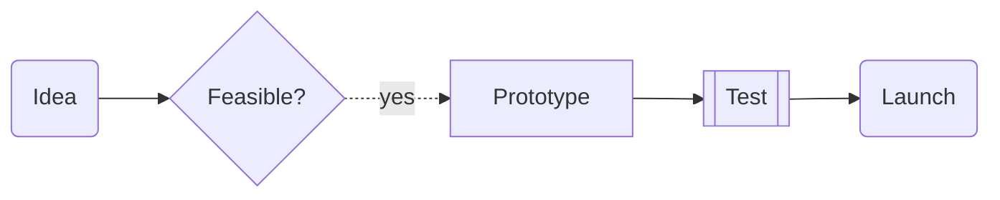
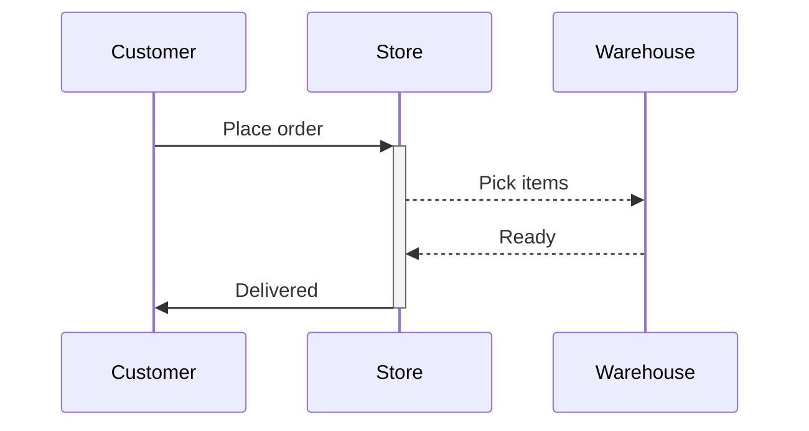
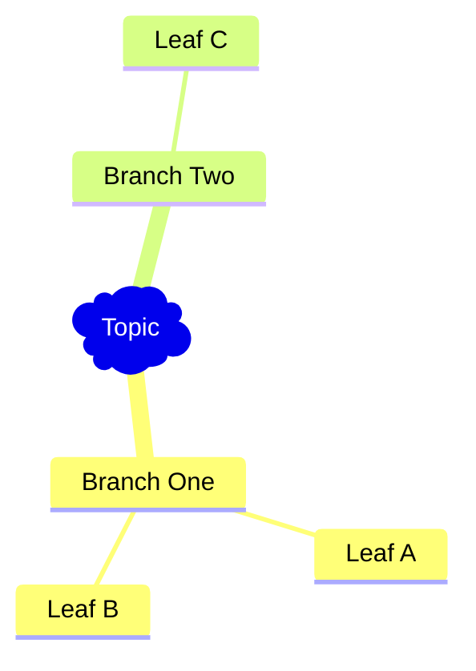
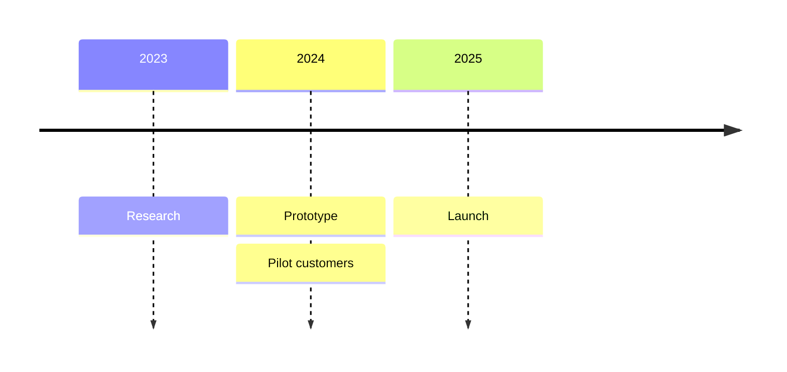

# Presenty Markdown Syntax Reference

Presenty renders Markdown into a Reveal.js presentation. Everything below is
supported syntax with working examples. Copy these shapes closely — they are
taken from Presenty's own feature-showcase presentation.

## Contents
1. [Slides & headings](#slides--headings)
2. [Slide directives (animation, background, transition)](#slide-directives)
3. [Animated diagrams: mermaid-steps](#animated-diagrams-mermaid-steps)
4. [Static mermaid diagrams](#static-mermaid-diagrams)
5. [Clickable links in mindmaps: %%URL%%](#clickable-links-in-diagrams)
6. [Charts: chartjs](#charts-chartjs)
7. [Raw HTML blocks (stacked images, popups)](#raw-html-blocks)
8. [Images](#images)
9. [Common mistakes](#common-mistakes)

---

## Slides & headings

- Separate slides with `***` on its own line (blank line before and after).
- `#` = H1, `##` = H2, `###` = H3. Titles render big — `###` is a good default
  for slide titles, `#####` for small subtitle lines. Slides are a fixed-size
  canvas: content that would overflow gets scaled down or clipped, so keep each
  slide to a title plus a handful of short lines or one visual.

```markdown
### Slide Title

##### A short punchy subtitle

***

### Next Slide
```

## Slide directives

HTML comments at the **top of a slide** configure that slide.

### Auto-animate (text morphs between slides)

Put `<!-- .slide: data-auto-animate -->` on two or more **consecutive** slides
that share some identical elements. Matching elements (same heading text)
smoothly move/resize; new elements fade in. The classic build-up pattern:

```markdown
<!-- .slide: data-auto-animate -->

## Why Solar Energy?

***

<!-- .slide: data-auto-animate -->

## Why Solar Energy?

##### Clean. Renewable. Cheaper every year.
```

The animation only works if consecutive slides repeat the same text — reuse the
heading verbatim and add lines beneath it.

### Backgrounds (color / image / video)

```markdown
<!-- .slide: data-background-color="rgb(70, 70, 255)" -->

### A colored slide

***

<!-- .slide: data-background-image="https://images.unsplash.com/photo-1444703686981-a3abbc4d4fe3" -->

### An image background

***

<!-- .slide: data-background-video="https://www.w3schools.com/html/mov_bbb.mp4" -->

### A video background
```

Background URLs must be full absolute URLs to publicly reachable files.
With image/video backgrounds, keep on-slide text minimal (it can clash with
the background) — a single short heading works best.

### Per-slide transition

```markdown
<!-- .slide: data-transition="zoom" -->

## This slide zooms in
```

Values: `zoom`, `fade`, `slide`, `concave`, `convex`, `none`. `zoom` is the
crowd-pleaser — use it for a big-reveal slide.

You can stack directives on one slide by putting each comment on its own line.

## Animated diagrams (mermaid-steps)

` ```mermaid-steps ` is Presenty's signature feature: the diagram draws itself
node-by-node as the presenter advances. It works with **flowchart**,
**sequenceDiagram**, and **mindmap** only. Use standard mermaid code inside.

````markdown
### How It Works — Step by Step


````

````markdown

````

````markdown

````

## Static mermaid diagrams

` ```mermaid ` renders any mermaid diagram type in one shot: `flowchart`,
`sequenceDiagram`, `mindmap`, `gitGraph`, `timeline`, `sankey-beta`,
`stateDiagram-v2`, `quadrantChart`, `classDiagram`, pie, etc.

````markdown
### Project Timeline


````

Keep node labels short — long labels shrink the whole diagram. FontAwesome
icons work in flowcharts: `F(fa:fa-rocket Launch)`.

## Clickable links in diagrams

Inside **mindmap** nodes (works in both `mermaid` and `mermaid-steps`), append
`%%URL%%` to make the node clickable:

```
mindmap
    root)Learn More(
        Documentation %%https://mermaid.js.org/%%
        History - click to open %%https://en.wikipedia.org/wiki/Mind_map%%
```

## Charts (chartjs)

` ```chartjs ` renders an interactive Chart.js chart. The body must be **strict
JSON** — double-quoted keys and strings, no comments, no trailing commas, no
JavaScript functions. Supported types include `bar`, `line`, `pie`, `doughnut`,
`radar`, `polarArea`, `bubble`, `scatter`.

````markdown
### Adoption Growth

```chartjs
{
    "type": "bar",
    "data": {
        "labels": ["2022", "2023", "2024", "2025"],
        "datasets": [{
        "label": "Users (thousands)",
        "data": [12, 45, 90, 160],
        "backgroundColor": ["#FF6F61", "#6BFED5", "#6B8EFE", "#FFD06B"]
        }]}
}
```
````

Line-chart extras that work: `"borderColor"`, `"backgroundColor"`,
`"pointStyle"`, `"pointRadius"`, `"pointHoverRadius"`.

## Raw HTML blocks

` ```html ` injects HTML into the slide. Two high-impact uses:

**Stacked images revealed step by step** (Reveal.js fragments):

````markdown
#### The Journey

```html

<div class="r-stack">
    
    
    
</div>
```
````

**Popup website / popup image:**

````markdown
```html

<a href="https://example.com" data-preview-link>Click to open website</a>
```
````

````markdown
```html

<a data-preview-image="https://images.unsplash.com/photo-1444703686981-a3abbc4d4fe3">📸 Open Image</a>
```
````

## Images

Plain HTML `` tags work directly in slides:

```markdown

```

Rules that matter:
- Always use a full absolute `https://` URL from a free public source.
- **Never** use `https://www.presenty.dev/...` image URLs — those belong to the
  app itself.
- Do not invent Unsplash photo IDs — a guessed
  `images.unsplash.com/photo-...` URL is almost always a 404. Safe options:
  - `https://picsum.photos/seed/<any-word>/800/500` — always resolves; themed
    seed words give varied, professional photos.
  - The one known-good Unsplash URL:
    `https://images.unsplash.com/photo-1444703686981-a3abbc4d4fe3` (starry sky).
  - A real image URL you verified via web search/fetch.
- Size images with the `width` attribute so they fit the slide (~700–900 wide).

## Common mistakes

- **Missing blank line around `***`** — the separator must be alone on its line.
- **`***` inside a code fence** — never place the separator inside a
  ```` ``` ```` block; close the fence first.
- **mermaid-steps with unsupported types** — only flowchart, sequenceDiagram,
  mindmap animate. Use plain ` ```mermaid ` for gitGraph, timeline, pie, etc.
- **Invalid JSON in chartjs** — single quotes or trailing commas silently break
  the chart. Mentally `JSON.parse` it before shipping.
- **Auto-animate with nothing in common** — consecutive auto-animate slides
  must repeat identical text for the morph to read as animation.
- **Walls of text** — Presenty presentations shine when each slide is one idea:
  a heading, at most 2–4 short lines, or one diagram/chart/image.
- **Special characters in mermaid labels** — avoid `(`, `)`, `"` inside node
  text (they collide with mermaid shape syntax); spell words out instead.
